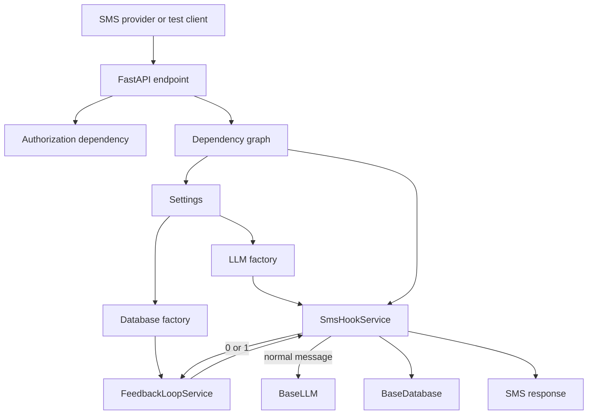

# Architecture

## Purpose

`sms-to-llm` is a small FastAPI service that receives SMS messages, handles feedback, builds conversation context, asks an LLM for a reply, and stores the resulting conversation record.

The design favors small interfaces and explicit composition. Provider-specific details stay behind factories and abstract base classes, while the service layer owns the conversation workflow.

## High-level Request Flow



For a normal message:

1. The endpoint extracts and validates the incoming payload.
2. FastAPI resolves settings, LLM, database, feedback loop, and the SMS hook service.
3. The feedback loop checks whether the message is `0` or `1`.
4. If it is feedback, the last conversation record is updated and the request ends.
5. Otherwise, the service builds a prompt from the system prompt and recent history.
6. The LLM generates a response.
7. The completed exchange is stored and returned to the endpoint.

## Separation of Concerns

### Endpoints

`src/sms_to_llm/endpoints/` owns HTTP concerns:

- Parse JSON, form-encoded Twilio data, and fallback payloads.
- Validate request and response models.
- Validate Twilio signatures for the Twilio route.
- Apply authorization dependencies to protected routes.
- Convert the service response into JSON or TwiML XML.

Endpoints should not contain conversation logic, provider selection, or persistence rules.

### Services

`src/sms_to_llm/service/` owns application behavior:

- `SmsHookService` orchestrates one incoming SMS request.
- `FeedbackLoopService` recognizes `0` and `1`, then updates the most recent message.

Services depend on interfaces such as `BaseLLM` and `BaseDatabase`, not concrete provider implementations. This keeps the workflow testable and replaceable.

### Providers

`src/sms_to_llm/llm/` and `src/sms_to_llm/database/` contain provider implementations.

- `BaseLLM` defines the LLM contract.
- `MockLLM` supports local development and unit tests.
- `OllamaLLM` calls the Ollama HTTP API.
- `BaseDatabase` defines persistence operations.
- `MongoDatabase` currently provides the database implementation used by the service.

Provider code handles external system details. It should not decide how an SMS conversation flows.

### Schemas

`src/sms_to_llm/schema/` contains Pydantic models shared across boundaries:

- `SmsIncomingMessage` normalizes JSON and Twilio field aliases.
- `SmsHookResponse` defines the service response contract.
- `ConversationMessage` defines the stored conversation record.
- `FeedbackValue` restricts feedback to `positive` or `negative`.

Schemas provide a single validation boundary and make data contracts explicit.

## Dependency Injection

FastAPI composes request dependencies in `src/sms_to_llm/dependencies.py` using `Annotated` and `Depends`:

```python
settings -> create_llm(settings)
settings -> create_database(settings)
database -> FeedbackLoopService(database)
settings + llm + database + feedback -> SmsHookService(...)
```

The service itself does not construct its dependencies. Its constructor receives `BaseLLM`, `BaseDatabase`, `Settings`, and `FeedbackLoopService` explicitly. This gives unit tests full control over collaborators and prevents application configuration from being hidden inside business logic.

FastAPI dependencies are request-scoped by default. The database factory separately caches Mongo instances by database URL so requests in the same process share the configured in-memory/provider instance.

## Factories and Extension Points

Factories isolate provider selection from the rest of the application:

- `create_llm(settings)` selects `mock` or `ollama` from `LLM_PROVIDER`.
- `create_database(settings)` selects the configured database provider from `DATABASE_TYPE`.

To add a provider:

1. Implement the relevant base interface.
2. Add its settings to `Settings`.
3. Add a factory branch.
4. Add unit tests for factory selection and provider behavior.
5. Add integration tests when an external service is required.

The service layer should continue to use the base interface rather than checking provider names.

## Configuration Management

`src/sms_to_llm/config.py` defines a Pydantic Settings model backed by environment variables and `.env`:

- `.env.example` documents the available local settings.
- Copy it to `.env` with `cp .env.example .env`.
- `.env` is ignored by Git because it may contain secrets.
- `SettingsWithoutEnv` is used by tests to avoid loading a developer's local `.env`.
- `SYSTEM_PROMPT_PATH` points to the Markdown system prompt.
- `OLLAMA_TIMEOUT_SECONDS` controls HTTP timeout behavior.
- `OLLAMA_MAX_TOKENS` controls the Ollama generation limit.

Defaults support a safe local mode using the mock LLM. Production or integration environments should provide explicit credentials, provider settings, and URLs.

## Authorization

`src/sms_to_llm/auth/authorization.py` centralizes bearer-token role checks.

- User routes use `require_user_key`.
- Admin routes use `require_admin_key`.
- The default user tokens are `admin` and `user`.
- The default admin token is `admin`.
- Missing or invalid user credentials return `401`.
- A valid user token without admin access returns `403`.

The test SMS endpoint requires user authorization. The conversation listing endpoint is admin-only. Twilio authentication is separate: the Twilio route validates the provider signature when a Twilio auth token and signature are present.

## Prompt and Conversation Context

The Markdown file at `prompts/system_prompt.md` is loaded by `SmsHookService`. The service combines it with a bounded recent conversation history and the new user message before calling the LLM.

The prompt is intentionally kept as an editable application asset rather than embedded in Python. This allows prompt changes without changing the orchestration code. The history limit is configurable at the service boundary and defaults to the five most recent records.

## Validation and Error Boundaries

Pydantic validates external and persisted data at the schema boundary. FastAPI turns invalid request models into HTTP validation errors, while the endpoint explicitly returns `400` for malformed or missing webhook payloads.

Provider failures are kept in provider code. For example, the Ollama implementation translates HTTP failures into a `RuntimeError` rather than exposing HTTP-client details to the service layer.

## Testing Strategy

Tests are divided by responsibility:

- Schema tests verify aliases, required fields, and feedback values.
- Provider tests verify base contracts and factory selection.
- Endpoint tests verify payload formats, authorization, TwiML responses, and service behavior.
- Authorization and admin tests verify role boundaries and conversation access.
- Integration tests are marked `integration` and excluded from normal runs because they require a live Ollama service.

Run the standard suite with:

```bash
uv run pytest -q
```

Run external-service tests explicitly with:

```bash
uv run pytest -m integration -q
```

## Test Fixtures and Doubles

`tests/conftest.py` provides the shared FastAPI `TestClient` fixture. Unit tests use `Mock(spec=BaseLLM)` and `Mock(spec=BaseDatabase)` so tests can control responses and verify interactions while still respecting the provider interfaces.

The mock LLM is the default provider, which keeps endpoint tests deterministic and prevents normal test runs from requiring Ollama, MongoDB, or Twilio.

## Operational Notes

- Ollama runs separately from the FastAPI process and must be available at `OLLAMA_BASE_URL` for integration tests.
- The first request after loading an Ollama model can be slow; increase `OLLAMA_TIMEOUT_SECONDS` when needed.
- The service returns TwiML XML for `/sms/hook` and JSON for `/test/sms/hook`.
- The application currently uses a process-local database provider cache. A production database implementation should define its connection lifecycle and concurrency behavior explicitly.

## Design Trade-offs

This is intentionally a small service rather than a framework-heavy application:

- Explicit interfaces make provider replacement easy without adding a container framework.
- FastAPI's dependency graph is sufficient for composition and test overrides.
- Pydantic models keep boundary validation close to the data contract.
- A Markdown prompt is easy to edit, but prompt versioning and templating are intentionally left for future work.
- The current bearer-token authorization is suitable for local/testing workflows; production deployments should use a proper secret-management and identity strategy.
